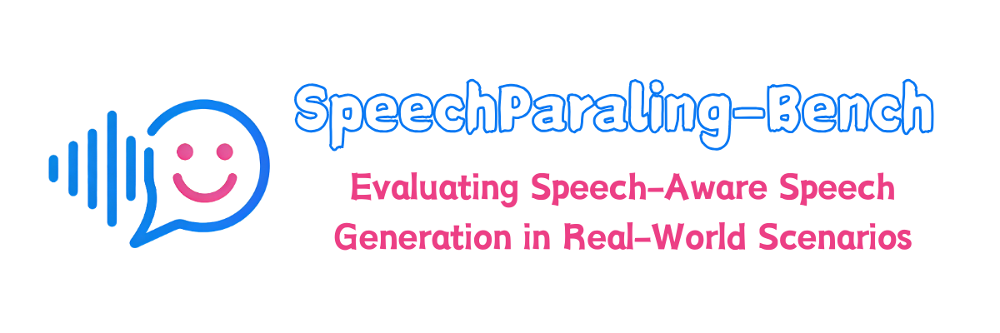

# SpeechParaling-Bench: A Comprehensive Benchmark for Paralinguistic-Aware Speech Generation


<p align="center">
    
</p>

<font size=7><div align='center' >[[📖 Paper](https://arxiv.org/)] [[🌐 Project Page](https://speechparaling-bench.github.io/)] [[🤗 Dataset](https://huggingface.co/datasets/Ruohan2)] [[💻 Code](https://github.com/Northern-byte-bit/SpeechParaling-Bench)]

**SpeechParaling-Bench** is a comprehensive benchmark designed to evaluate **paralinguistic-aware speech generation** capabilities of large audio-language models (LALMs). It features **100+ paralinguistic dimensions** and **1000+ Chinese-English evaluation samples**, using a **baseline-candidate comparative evaluation** approach to produce a leaderboard for mainstream multimodal large models.

## 🗒 SpeechParaling-Bench Overview

The benchmark covers three core evaluation dimensions:

- **Paralanguage Control (可控生成)**: Evaluates single-dimensional and multi-dimensional paralinguistic information generation capabilities
- **Dynamic Variation (动态调节)**: Assesses models' ability to dynamically adjust paralinguistic features
- **Situational Adaptation (情景共情)**: Tests situational empathy and context-appropriate paralinguistic expression

All instructions are aligned in both Chinese and English, covering diverse real-life scenarios such as daily life, campus, workplace, family, and entertainment. The generated content naturally and reasonably matches the required paralinguistic information.

SpeechParaling-Bench aims to reflect the challenges of LALM paralinguistic generation and support fair, transparent, and extensible evaluation of next-generation LALM models.

## 📁 Repository Structure

```
SpeechParaling-Bench/
├── api_models/                    # API calling codes for mainstream models
│   ├── doubao/                    # Chinese baseline model
│   │   ├── output_ch/             # Chinese output audio
│   │   └── output_en/             # English output audio
│   ├── gemini/                    # English baseline model
│   │   ├── output_ch/
│   │   └── output_en/
│   ├── gpt/
│   ├── qwen-omni/
│   └── qwen-omni-realtime/
├── audio_dataset_ch/              # Chinese audio dataset (3 dimensions)
│   ├── dyn_var/                   # Dynamic variation
│   ├── para_con/                  # Paralanguage control
│   │   ├── con_abs/
│   │   ├── con_long_multi/
│   │   ├── con_long_sin/
│   │   ├── con_short_multi/
│   │   └── con_short_sin/
│   └── sit_ada/                   # Situational adaptation
│       ├── sit_multi/
│       └── sit_sin/
├── audio_dataset_en/              # English audio dataset (3 dimensions)
│   ├── dyn_var/
│   ├── para_con/
│   └── sit_ada/
├── jsonl_prompt_ch/               # Chinese JSONL prompts & dimensions
├── jsonl_prompt_en/               # English JSONL prompts & dimensions
├── judge_data/                    # Evaluation data and codes
│   ├── judge_code/                # Evaluation codes for 3 dimensions
│   ├── result_v5/                 # Evaluation outputs
│   │   ├── judge_json/            # Model evaluations & scores
│   │   ├── metadata/              # Key data for score calculation
│   │   └── judge_result/          # Leaderboard results
│   └── score_calculate/           # Score calculation scripts
└── text_jsonl_generator/          # Codes for generating jsonl_prompt
```

## 🗃️ Dataset Access

The SpeechParaling-Bench dataset is available on 🤗 HuggingFace:

### Main Audio Datasets (Input)


| Dataset                                                                              | Description                      | Size   | Samples |
| ------------------------------------------------------------------------------------ | -------------------------------- | ------ | ------- |
| [SpeechParaling-Bench](https://huggingface.co/datasets/Ruohan2/SpeechParaling-Bench) | Chinese + English audio datasets | ~800MB | 2002    |


### Baseline Model Outputs


| Dataset                                                                                                | Description                         | Size   |
| ------------------------------------------------------------------------------------------------------ | ----------------------------------- | ------ |
| [SpeechParaling-Bench-Baseline](https://huggingface.co/datasets/Ruohan2/SpeechParaling-Bench-Baseline) | Doubao (Chinese) + Gemini (English) | ~480MB |


### Dataset Statistics


| Dimension | Chinese          | English          | Description            |
| --------- | ---------------- | ---------------- | ---------------------- |
| dyn_var   | 120 samples      | 120 samples      | Dynamic variation      |
| para_con  | 691 samples      | 691 samples      | Paralanguage control   |
| sit_ada   | 190 samples      | 190 samples      | Situational adaptation |
| **Total** | **1001 samples** | **1001 samples** |                        |


## 🚀 Quick Start

### 1. Clone the Repository

```bash
git clone https://github.com/Northern-byte-bit/SpeechParaling-Bench.git
cd SpeechParaling-Bench
```

### 2. Download the Dataset

You need to download both the main audio datasets and the baseline model outputs.

#### Option A: Using Python Script

```bash
pip install huggingface_hub

# Download main audio datasets
python script/download_data.py

# Download baseline model outputs
python script/download_baseline.py
```

#### Option B: Manual Download

You can also download the zip files directly from HuggingFace and extract them to the corresponding locations:

- **SpeechParaling-Bench**: [https://huggingface.co/datasets/Ruohan2/SpeechParaling-Bench](https://huggingface.co/datasets/Ruohan2/SpeechParaling-Bench)
  - Download `audio_dataset_ch.zip` → extract to project root
  - Download `audio_dataset_en.zip` → extract to project root
- **SpeechParaling-Bench-Baseline**: [https://huggingface.co/datasets/Ruohan2/SpeechParaling-Bench-Baseline](https://huggingface.co/datasets/Ruohan2/SpeechParaling-Bench-Baseline)
  - Download `api_models.zip` → extract to project root

### 3. (Optional) Download Other Model Outputs

If you want to evaluate with other models' outputs directly (without running the API yourself), you can download them from HuggingFace:

- SpeechParaling-Bench: [https://huggingface.co/datasets/Ruohan2/SpeechParaling-Bench](https://huggingface.co/datasets/Ruohan2/SpeechParaling-Bench)

More model outputs will be added soon.

### 4.  (Optional) Run Existing API Models

If you want to run the API models yourself to generate outputs, install the dependencies and run the scripts:

```bash
cd api_models
pip install -r requirements.txt
# Configure your API key and run MODEL_NAME/main.py
```

### 5. Prepare Your Model Output

Run your **speech-to-speech (S2S)** model on the SpeechParaling-Bench dataset and generate audio responses.

#### Sample Run Script

We provide a sample run script using **Qwen-Omni API** to help you get started quickly:

```bash
# 1. Go to the qwen-omni directory
cd api_models/qwen-omni

# 2. Run the sample script (Chinese)
python run_sample.py \
    --input_dir ../../audio_dataset_ch/para_con/con_short_sin \
    --output_dir output_ch/para_con/con_short_sin \
    --api_key YOUR_DASHSCOPE_API_KEY \
    --language zh

# 3. Run the sample script (English)
python run_sample.py \
    --input_dir ../../audio_dataset_en/para_con/con_short_sin \
    --output_dir output_en/para_con/con_short_sin \
    --api_key YOUR_DASHSCOPE_API_KEY \
    --language en
```

For testing, you can use `--max_files N` to process only N files:

```bash
python run_sample.py \
    --input_dir ../../audio_dataset_ch/para_con/con_short_sin \
    --output_dir output_demo \
    --api_key YOUR_DASHSCOPE_API_KEY \
    --language zh \
    --max_files 3
```

**Get API Key**: Register at [https://dashscope.console.aliyun.com/](https://dashscope.console.aliyun.com/) to get your free API key.

#### Output Directory Structure

Format your audio output according to the structure in `api_models/doubao/output_ch/`:

```
api_models/YOUR_MODEL/
├── output_ch/
│   ├── dyn_var/          # Dynamic variation outputs
│   │   ├── dyn_var_001.wav
│   │   ├── dyn_var_002.wav
│   │   └── ...
│   ├── para_con/         # Paralanguage control outputs
│   │   ├── con_abs/
│   │   ├── con_long_multi/
│   │   ├── con_long_sin/
│   │   ├── con_short_multi/
│   │   └── con_short_sin/
│   └── sit_ada/          # Situational adaptation outputs
│       ├── sit_multi/
│       └── sit_sin/
└── output_en/
    ├── dyn_var/
    ├── para_con/
    └── sit_ada/
```

### 6. Run Evaluation

Use the evaluation codes in `judge_data/judge_code/`:

1. **Add your API_KEY** in the evaluation script
2. **Modify the paths** in `MODEL_DIRS` and `OUTPUT_DIRS`:

```python
# Example: judge_data/judge_code/dyn_var/dyn_var_ch.py

API_KEY = "YOUR_API_KEY"

MODEL_DIRS = {
    "doubao": "api_models/doubao/output_ch/dyn_var",
    "YOUR_MODEL_NAME": "api_models/YOUR_MODEL/output_ch/dyn_var",  # Add your model
}

OUTPUT_DIRS = {
    "doubao": "judge_data/result_v5/result_v5_dyn_var/judge_json/judge_json_v5_dyn_ch/doubao",
    "YOUR_MODEL_NAME": "judge_data/result_v5/result_v5_dyn_var/judge_json/judge_json_v5_dyn_ch/YOUR_MODEL_NAME",  # Add your output path
}
```

1. **Run the evaluation**:

```bash
# Dynamic Variation - Chinese
python judge_data/judge_code/dyn_var/dyn_var_ch.py

# Dynamic Variation - English
python judge_data/judge_code/dyn_var/dyn_var_en.py

# Paralanguage Control - various configurations
python judge_data/judge_code/para_con/para_con_long_sin_ch.py
python judge_data/judge_code/para_con/para_con_short_sin_ch.py
python judge_data/judge_code/para_con/para_con_abstract_ch.py
# ... etc

# Situational Adaptation
python judge_data/judge_code/sit_ada/sit_ada_sin_ch.py
python judge_data/judge_code/sit_ada/sit_ada_multi_ch.py
# ... etc
```

### 7. Calculate Scores

After evaluation, calculate the leaderboard scores (use dynamic variation as an example):

```bash
python judge_data/score_calculate/score_calculate_dyn_var.py
```

Results will be saved in `judge_data/result_v5/result_v5_dyn_var/judge_result/`.

---

## 📊 Evaluation Dimensions


| Dimension    | Description            | Configurations                                                |
| ------------ | ---------------------- | ------------------------------------------------------------- |
| **dyn_var**  | Dynamic Variation      | Chinese/English                                               |
| **para_con** | Paralanguage Control   | Long/Short, Single/Multi-dimension, Abstract, Chinese/English |
| **sit_ada**  | Situational Adaptation | Single/Multi-dimension, Chinese/English                       |


## 📄 Citation

If you use SpeechParaling-Bench in your research, please cite:

```bibtex
@misc{speechparaling-bench2026,
      title={SpeechParaling-Bench: A Comprehensive Benchmark for Paralinguistic-Aware Speech Generation}, 
      author={Liu, Ruohan and Yin, Shukang and Wang, Tao and Zhang, Dong and Zhuang, Weiji and Ren, Shuhuai and He, Ran and Shan, Caifeng and Fu, Chaoyou},
      year={2026},
}
```

## 📜 License

This project is licensed under the Apache-2.0 License.

## 🙏 Acknowledgements

We thank the following models and tools that made this benchmark possible:

- Gemini-2.5-Flash / Gemini-3 Pro (Evaluation)
- Doubao Realtime (Baseline)
- Gemini Audio (Baseline)
- GPT Audio
- Qwen-Omni
- Index-TTS

## 📧 Contact

For questions and feedback, please open an issue on GitHub or contact [[221900134@smail.nju.edu.cn](mailto:221900134@smail.nju.edu.cn)].
